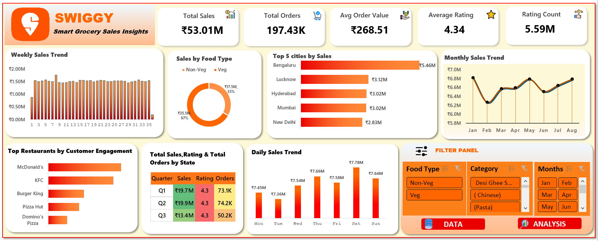
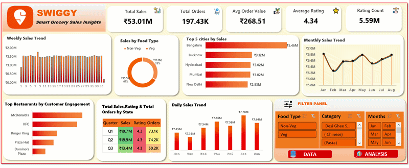

# 🛒 Swiggy Sales Insights Dashboard (Excel)

---

## 🔎 Project Overview

This project focuses on analyzing Swiggy sales data using Microsoft Excel.

An interactive dashboard was built to analyze:
- Sales performance
- Customer engagement
- Food category trends
- Restaurant performance
- City-wise sales insights

The dashboard helps in understanding customer behavior and business growth using real-world business metrics.

---

## 📌 Key KPIs

- Total Sales
- Total Orders
- Average Order Value
- Average Rating
- Rating Count

---

## 📊 Dashboard Features

- Weekly Sales Trend
- Monthly Sales Trend
- Daily Sales Trend
- Sales by Food Type
- Top 5 Cities by Sales
- Top Restaurants by Customer Engagement
- Quarter-wise Sales & Orders Analysis
- Interactive Filters using Slicers

---

## 📷 Dashboard Preview

---

## 🎥 Interactive Dashboard Demo (Video)
A short screen recording demonstrating:
- Slicer-based filtering  
- Dynamic KPI updates  
- Interactive Excel dashboard behavior  

👉 **Watch the demo video here:**  

---

## 🛠 Tools & Technologies Used

- Microsoft Excel
- Pivot Tables
- Pivot Charts
- Slicers
- Conditional Formatting
- Interactive Dashboard Design
- Data Cleaning

---

## 🗂 Dataset Information

The dataset contains:
- State
- City
- Order Date
- Restaurant Name
- Food Category
- Dish Name
- Food Type
- Price
- Rating
- Rating Count

---

## 📈 Key Insights

- Bengaluru generated the highest sales revenue.
- Non-Veg food contributed the largest sales share.
- Weekend sales were comparatively higher.
- Customer ratings remained consistently high.
- McDonald's showed strong customer engagement.

---

## 📁 Files Included

- Swiggy_Dashboard.xlsx
- README.md
- Dashboard Screenshot
- Images used in Dashboard

---

## 🚀 Project Outcome

This project improved my skills in:
- Data Cleaning
- Data Visualization
- Business Analysis
- KPI Reporting
- Dashboard Design
- Excel Analytics

  ---

## 📬 Connect With Me
- LinkedIn: *(www.linkedin.com/in/gitasri-das)*  
